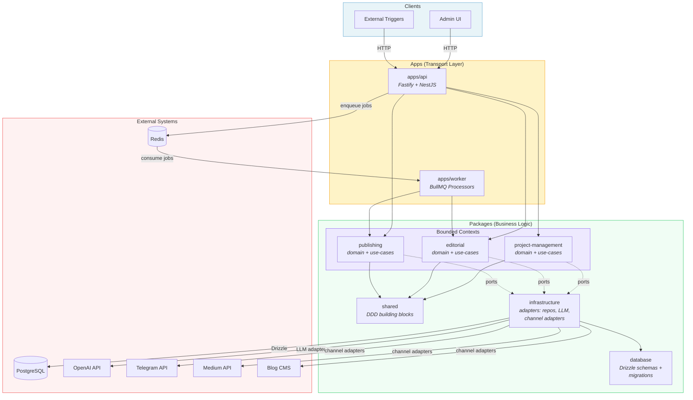
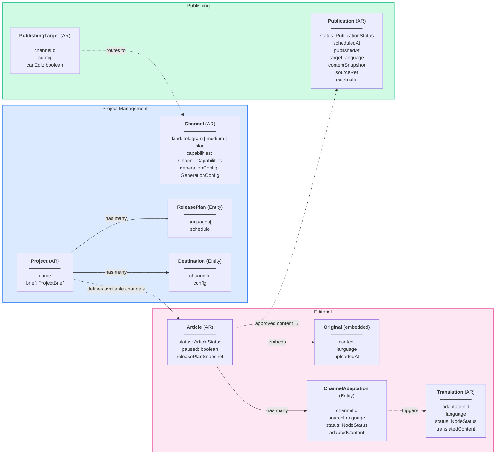
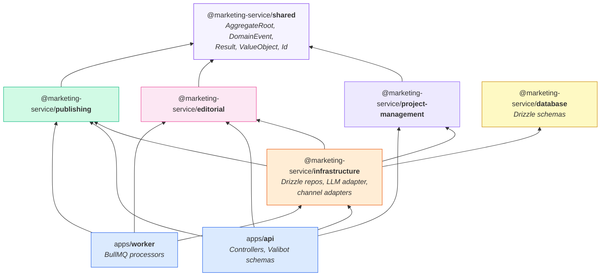
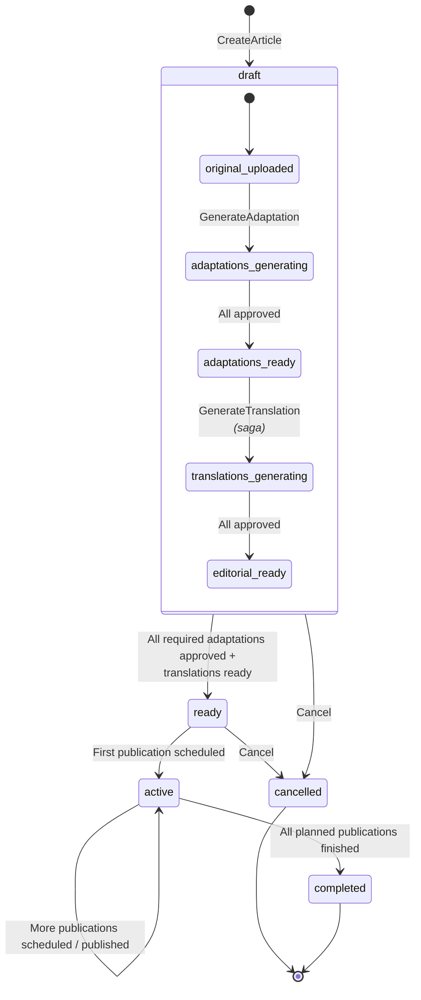
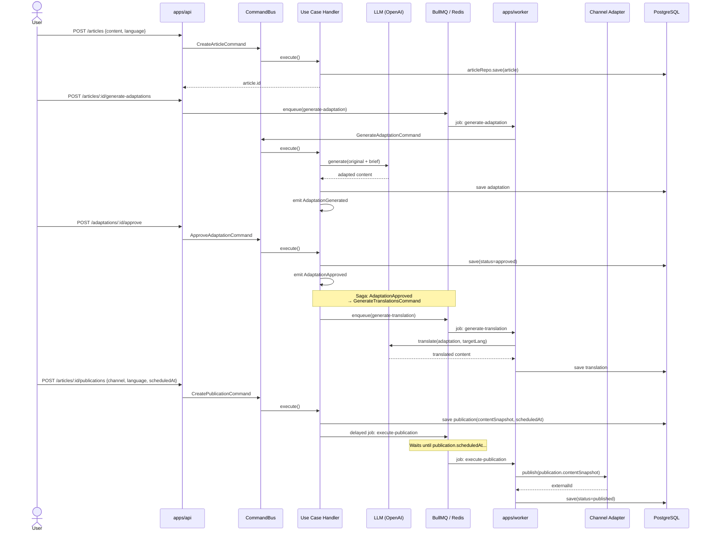
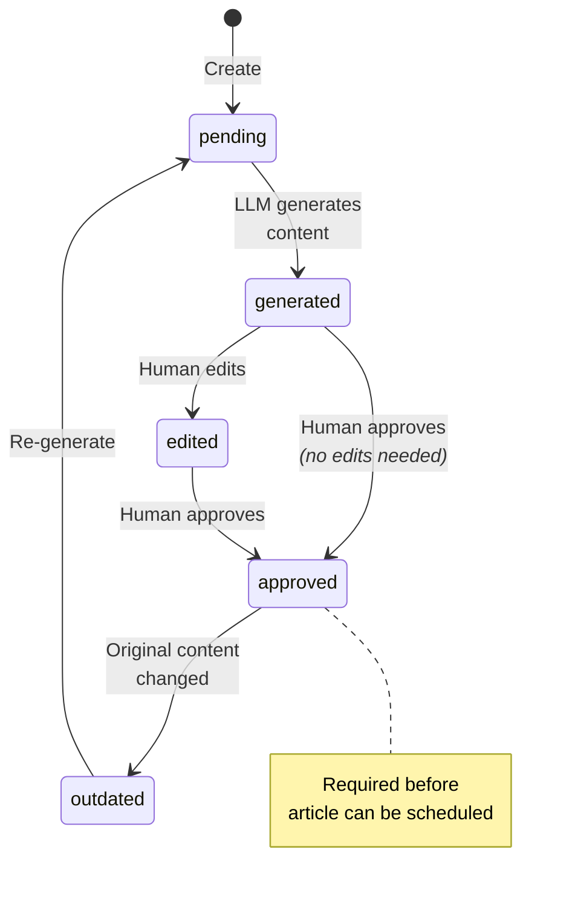
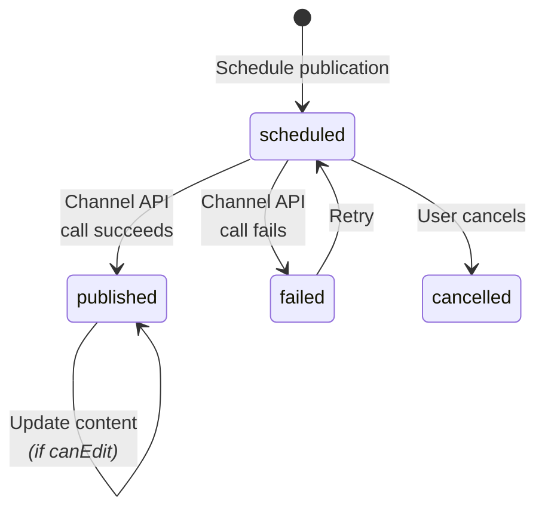
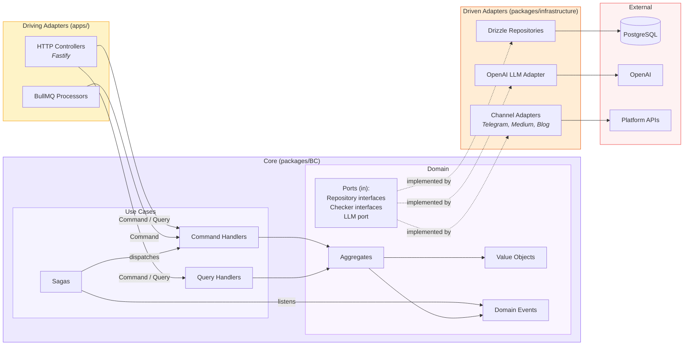

# Marketing Service — Diagrams

## 1. High-Level Architecture

## 2. Bounded Contexts & Domain Model

## 3. Dependency Graph (Packages)

## 4. Article Lifecycle (State Machine)

## 5. Content Pipeline (Data Flow)

## 6. Node Status (Adaptation / Translation)

## 7. Publication Status

## 8. Hexagonal Architecture (Ports & Adapters)

